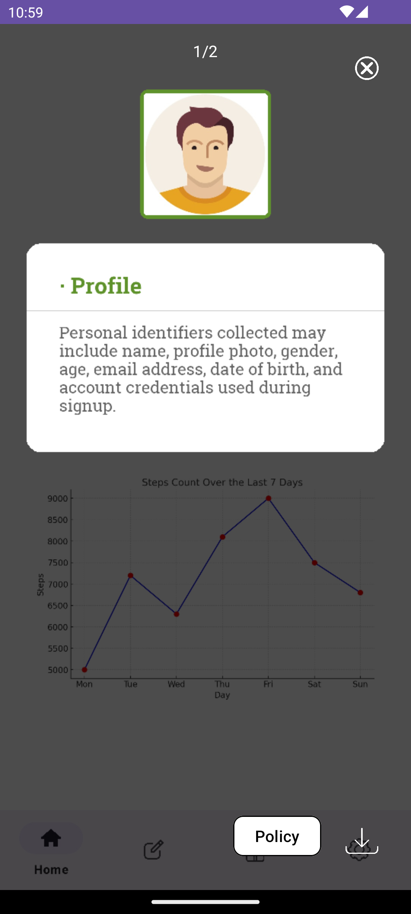
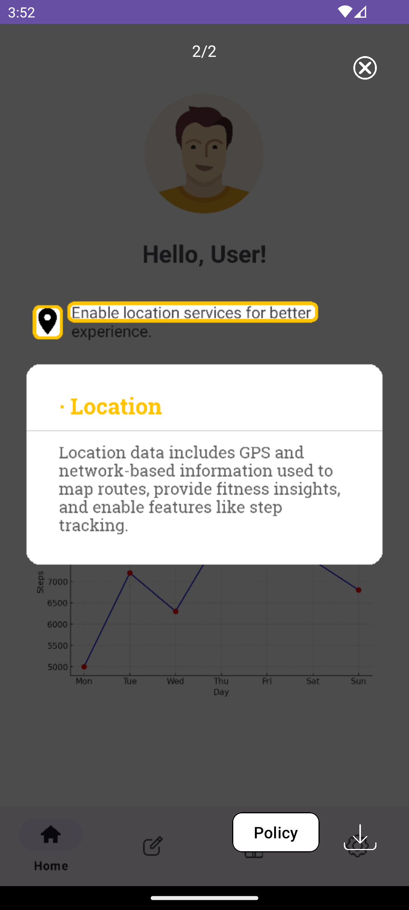
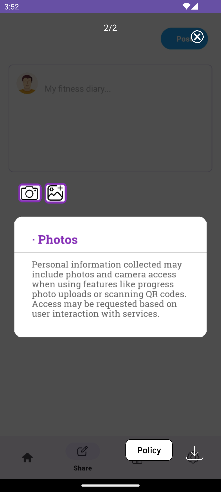

# 👁️ PrivScan SDK for Android
🎥 [Demo Video](https://www.youtube.com/watch?v=ck-25otfyHc) ｜  📱 [Dummy App with PrivScan SDK](https://github.com/buyanghc/PrivScanDemo) ｜  🧪 [SEEPRIVACY (Our earlier work)](https://www.usenix.org/conference/usenixsecurity24/presentation/pan-shidong-hope) ｜  🔧 [SEEPRIVACY API Code](https://github.com/buyanghc/SEEPRIVACY_API)

**PrivScan** is a lightweight Android SDK for identifying privacy-related GUI components on-screen.  
It provides a floating button to help users analyze the current interface and access relevant privacy policy information in real time.


---


## 🛡️ PrivScan Showcase

Below are example screenshots of contextual privacy notices automatically generated by PrivScan:

<div style="display: flex; gap: 12px;">
    
    
<!--      -->
</div>


---


## 🚀 Integration Guide

You can integrate the SDK into your Android project in one of two ways:

### Option 1: Using Git Submodule

```bash
git submodule add https://github.com/Cpp4App/PrivScan.git  sdk/PrivScan
```

Then add the following to your **settings.gradle.kts**:

```bash
include(":PrivScan")
project(":PrivScan").projectDir = file("sdk/PrivScan")
```

And in your app module's **build.gradle.kts**:

```bash
dependencies {
    implementation(project(":PrivScan"))
}
```

### Option 2: Manual Copy
You may also manually copy the **PrivScan/** folder into your project and configure it the same way in **settings.gradle.kts**.

## 🧩 Usage

Initialize the SDK in your Application class:

```bash
import android.app.Application;
import android.graphics.Color;
import com.example.PrivScan.ButtonInjector;

public class MyApplication extends Application {

    @Override
    public void onCreate() {
        super.onCreate();
        
        // Initialize the privacy button injector for all activities
        ButtonInjector.init(this, (button, activity) -> {
          
            // Set the initial position of the button on the screen (x, y in pixels)
            button.setPosition(900f, 1950f);  
            
            // Set the size (diameter) of the button in pixels
            button.setSize(100f);  
            
            // Set the button\'s background image (e.g., icon or custom style)
            button.setImage(com.example.SeePrivacyButton.R.drawable.button_bg));  
            
            // Set the background color of the button (used when no image is set)
            button.setColor(Color.parseColor("#8800FF")); 
            
             // Set the official privacy policy URL of your app
            button.setPolicyUrl("https://your-privacy-policy-url.html");  
        });
    }
}
```

Also, register your custom Application class in **AndroidManifest.xml**:

```bash
<application
    android:name=".MyApplication"
    android:icon="@mipmap/ic_launcher"
    android:label="@string/app_name"
    ... >
</application>
```

---


## 📊 Evaluation

We conducted a runtime performance evaluation of the core functional modules in PrivScan.  
The tables below present timing statistics (in seconds) across three repeated tests for each sub‑process.  

The evaluation was performed using our [dummy app](https://github.com/buyanghc/PrivScanDemo),  
which includes three representative page types:  
- **Mixed** – pages containing both privacy-related icon elements and text elements  
- **Icon-only** – pages containing only privacy-related icons  
- **Text-only** – pages containing only privacy-related text  

Screenshots of these three page types are available in the `dataset/` folder for reference.

### ⏱️ Test1

| Process                          | Mixed  | Icon-only | Text-only | Avg    |
|----------------------------------|--------|-----------|-----------|--------|
| Textual component detection      | 1.059  | 0.906     | 1.099     | 1.021  |
| Iconic component detection       | 0.453  | 0.512     | 0.514     | 0.493  |
| Result merging                   | 0.050  | 0.040     | 0.070     | 0.053  |
| Textual component classification | 0.000  | 0.000     | 0.000     | 0.000  |
| Iconic component classification  | 1.460  | 1.760     | 1.130     | 1.450  |
| Paragraph-level processing       | 0.030  | 0.030     | 0.030     | 0.030  |
| Sentence-level processing        | 0.630  | 0.590     | 1.030     | 0.750  |
| Result matching                  | 0.000  | 0.000     | 0.000     | 0.000  |
| Shorten policy                   | 3.720  | 4.280     | 5.840     | 4.613  |
| Draw results on image            | 0.430  | 0.410     | 0.410     | 0.417  |
| Total time                       | 8.360  | 8.850     | 10.510    | 9.240  |

---

### ⏱️ Test2

| Process                          | Mixed  | Icon-only | Text-only | Avg    |
|----------------------------------|--------|-----------|-----------|--------|
| Textual component detection      | 1.225  | 0.943     | 1.021     | 1.063  |
| Iconic component detection       | 0.469  | 0.516     | 0.544     | 0.510  |
| Result merging                   | 0.050  | 0.040     | 0.050     | 0.047  |
| Textual component classification | 0.000  | 0.000     | 0.000     | 0.000  |
| Iconic component classification  | 1.580  | 2.040     | 1.300     | 1.640  |
| Paragraph-level processing       | 0.040  | 0.030     | 0.030     | 0.033  |
| Sentence-level processing        | 0.610  | 0.590     | 0.610     | 0.603  |
| Result matching                  | 0.000  | 0.000     | 0.000     | 0.000  |
| Shorten policy                   | 4.330  | 4.190     | 5.030     | 4.517  |
| Draw results on image            | 0.390  | 0.410     | 0.400     | 0.400  |
| Total time                       | 9.060  | 9.070     | 9.390     | 9.173  |

---

### ⏱️ Test3

| Process                          | Mixed  | Icon-only | Text-only | Avg    |
|----------------------------------|--------|-----------|-----------|--------|
| Textual component detection      | 1.151  | 1.032     | 1.068     | 1.084  |
| Iconic component detection       | 0.461  | 0.518     | 0.581     | 0.520  |
| Result merging                   | 0.050  | 0.040     | 0.050     | 0.047  |
| Textual component classification | 0.000  | 0.000     | 0.000     | 0.000  |
| Iconic component classification  | 1.420  | 2.150     | 1.180     | 1.583  |
| Paragraph-level processing       | 0.030  | 0.030     | 0.040     | 0.033  |
| Sentence-level processing        | 0.550  | 0.600     | 0.620     | 0.590  |
| Result matching                  | 0.000  | 0.000     | 0.000     | 0.000  |
| Shorten policy                   | 4.320  | 4.040     | 5.010     | 4.457  |
| Draw results on image            | 0.400  | 0.430     | 0.440     | 0.423  |
| Total time                       | 8.630  | 9.200     | 9.320     | 9.050  |
